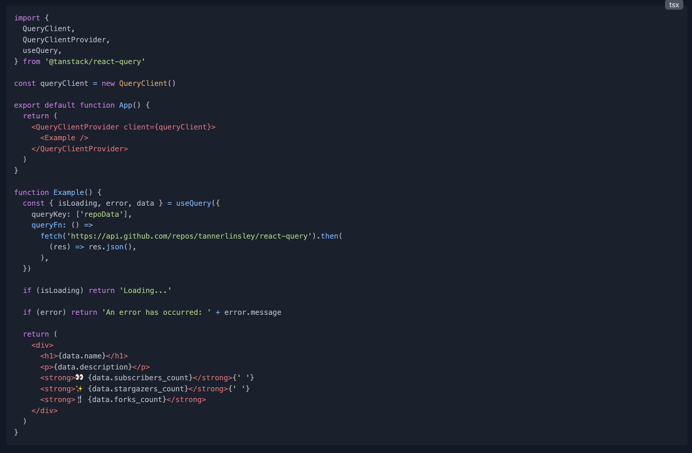
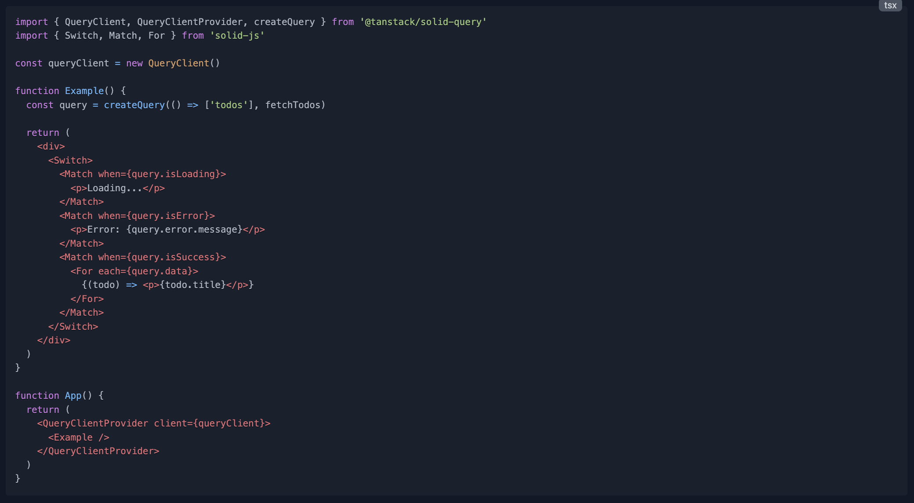

# SolidJS 初体验

最近公司分派了一个小项目给我，需要调用已有的接口检测文本并展示结果，要求能够在企业微信中浏览，不需要长期维护。

[在线尝试](https://tool.lijiaoyun.cn/corrector/)

## 确认技术栈

企业微信内置的浏览器不低，所以可以放心地使用大量的现代特性，但为了保险起见，最好还是加上一些 Polyfill。我习惯了使用 Vite，使用 @vitejs/plugin-legacy 可以轻松地加上 Polyfill。

往常我会使用 Vue 来做开发，但这个项目并不需要长期维护，我可以尝试一些我感兴趣的新东西，比如 SolidJS 和 Svelte 等。前者主要使用 JSX 和 Proxy，后者则类似于 Vue，但完全没有运行时。由于 Svelte 配置过于繁琐，我选择了不需要什么额外配置的 SolidJS 来做这个项目。

需要说明的是，小项目 Svelte 和 SolidJS 打包出来比 Vue 要小，这一点可以自行测试一下。构建产物更小，也就意味着用户浏览器可以更快速地加载完毕，用户体验相当不错

## 初始化项目

我根据官网指引初始化了项目，随后自行增加了 ofetch 作为网络请求库，用 unocss 来构建样式。

```shell
npx degit solidjs/templates/ts corrector
```

尽管 axios 比 ofetch 更流行，我也更熟悉 axios，但是 axios 有一个致命缺点，那就是太大了。在 npm 上查看，axios v1.4.0 有 1.74MB，而 ofetch v1.1.0 只有 35.6kB。

而 unocss 相比 tailwindcss 提供了更好的灵活性，同时它还支持图标，省去了我再去安装 unplugin-icons 或者 @iconify-icon/solid 来使用图标的麻烦。

## 体验感觉

我的第一感觉是 Solid 和 React 非常相似，同样使用 JSX 语法，我使用起来非常顺手。

得益于 Solid 底层使用了 Proxy，Solid 提供的 createEffect 和 Vue 的 watchEffect 类似，不需要显式地写依赖，这一点会比 React 的 useEffect 舒服不少。Solid 也提供了官方 Store，不需要用户再去苦苦寻找一个合适的方案了。

但是，Solid 的控制流又会比 React 繁琐。以 tanstack-query 来举例，React 的例子要比 Solid 清晰得多。React 可以提前返回，而 Solid 只能在 Switch 里写好几个 Match，否则响应式就可能失效了。





## 关于死循环的思考

Solid 提供的 createEffect 用起来一时爽，但是不爽的时候就火葬场了。下面就是我遇到的实际问题的抽象。

```tsx
import { ofetch } from 'ofetch';
import {
  createSignal,
  createEffect,
  Switch,
  Match,
  For,
  type Component,
} from 'solid-js';

type AnyRecord = Record<string, any>;

interface Props {
  text: string;
}

const Demo: Component<Props> = (props) => {
  const [data, setData] = createSignal<AnyRecord[]>([]);
  const [error, setError] = createSignal<string>('');
  const [isLoading, setIsLoading] = createSignal(false);
  const [abortController, setAbortController] = createSignal(new AbortController());
  const handleRequest = async () => {
    abortController().abort();
    setAbortController(new AbortController());
    setIsLoading(true);
    await ofetch('https://fake/url', {
      // ...
      signal: abortController().signal,
    })
  };

  createEffect(() => {
    if (props.text) handleRequest();
  });

  return (
    <div class="mt-4 w-full flex-none border rounded p-4 md:mx-4 md:w-[calc(50%-2rem)]">
      <Switch>
        <Match when={isLoading()}>
          <div class="mt-4 w-full flex items-center justify-center">
            <i class="i-eos-icons:bubble-loading" />
          </div>
        </Match>
        <Match when={!isLoading() && !!error()}>
          <div class="mt-4 w-full leading-loose text-red-500">{error()}</div>
        </Match>
        <Match when={!isLoading() && !error() && data().length === 0}>
          <div class="mt-4 w-full text-center leading-loose text-gray-500">暂无结果</div>
        </Match>
        <Match when={!isLoading() && !error() && data().length > 0}>
          ...
        </Match>
      </Switch>
    </div>
  );
};

export default Demo;

```

这个组件还算简洁。我使用了 createEffect，当传入的 text 是非空字符串时触发 handleRequest 方法。而 handleRequest 方法中会尝试使用 abortController 取消前一次请求，设置新的 abortController 后调用 ofetch 发起请求。

听起来一切正常？但是实际运行时却出现了死循环！🤔️ 这是为什么？你可以先想一下再往下看。

想到了吗？如果还没有想到，[Vue 文档](https://cn.vuejs.org/guide/essentials/watchers.html#watcheffect) 中类似的话语可能会对你有所启发。

> watch 和 watchEffect 都能响应式地执行有副作用的回调。它们之间的主要区别是追踪响应式依赖的方式：
>
> - watch 只追踪明确侦听的数据源。它不会追踪任何在回调中访问到的东西。另外，仅在数据源确实改变时才会触发回调。watch 会避免在发生副作用时追踪依赖，因此，我们能更加精确地控制回调函数的触发时机。
>
> - watchEffect，则会在副作用发生期间追踪依赖。它会在同步执行过程中，自动追踪所有能访问到的响应式属性。这更方便，而且代码往往更简洁，但有时其响应性依赖关系会不那么明确。

和 Vue 的 watchEffect 类似，Solid 的 createEffect 也会自动追踪所有能访问到的响应式属性。在这里，我使用了 createSignal 来创建 abortController，这意味着 abortController 就是一个可访问到的响应式属性。设置新的 abortController 会重新触发 createEffect，而触发 createEffect 又会设置新的 abortController，所以最后出现了死循环。

要怎么做才能解决这个问题？很简单，不要用 createSignal 创建 abortController，用 let 来创建就可以了。

[Solid 文档](https://www.solidjs.com/docs/latest/api#createeffect) 中也特别提到了这一点。

> effect 主要用于读取但不写入反应系统的副作用：最好避免在 effect 中设置 signal，如果不小心可能会导致额外的渲染甚至无限 effect 循环。相反，更喜欢使用 createMemo 来计算依赖于其他响应式值的新值，因此响应式系统知道什么依赖于什么，并可以相应地进行优化。

这个问题也在某种程度上说明了 React useEffect 的依赖数组的两面性。明确的依赖数组可以促使使用者认真思考依赖关系，有效地规避这类死循环问题，另一方面，也非常考验使用者的依赖分析能力。

## 小结

Solid 用起来非常简单，如果使用过 React，一定可以轻松上手。或许你会像我一样，满足于 Solid 简洁的 API，但是又对 Solid 繁琐的控制流感到不满。

目前 Solid 生态和 React 相比还差得远，期待 Solid 的进一步发展。
