# 用 TypeScript 编写 CI/CD Pipelines

相信大家平时或多或少接触过 CI/CD Pipelines。GitHub 有 [GitHub Actions](https://docs.github.com/en/actions)，GitLab 有 [GitLab CI/CD](https://docs.gitlab.com/ee/ci/)，它们都鼓励使用 YAML 来做配置。

但是我自己平时都是用 TypeScript 来开发，感觉 YAML 实在不顺手，网上也不只我一个抱怨这个问题，比如 [noyaml](https://noyaml.com/)、[The yaml document from hell](https://ruudvanasseldonk.com/2023/01/11/the-yaml-document-from-hell)。那有没有人像我一样，想要一个用 TypeScript 来做配置的 CI/CD Pipelines 呢？有的，那就是今天的主角——[cicada](https://cicada.build/)。

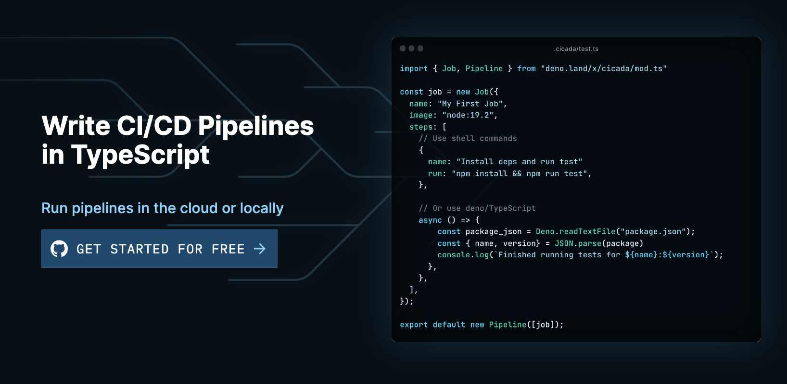

## 什么是 `cicada`

`cicada` 是蝉的意思。官网上它是这样介绍自己的。

> Cicada is a modern CI/CD engine that lets you write your pipelines in TypeScript. No more YAML-hell. Write your automations in a real programming language.
>
> Cicada is perfect for **JS/TS engineers** who want to write CI in the same language as their application and for **DevOps/Infra engineers** looking to leverage more powerful tools & abstractions.

简单翻译一下：

> Cicada 是一个现代 CI/CD 引擎，可以让你使用 TypeScript 编写管道。不再有 YAML 地狱。用真正的编程语言编写你的自动化。
>
> Cicada 非常适合想要用与应用程序相同的语言编写 CI 的 **JS/TS 工程师**，以及希望利用更强大的工具和抽象的 **DevOps/Infra 工程师**。

看这个介绍，非常适合我这种 JS/TS 切图崽啊！IDE 支持，能共享代码，能抽象封装，还能用 NPM 包。

但我还是没有冲动，万一收钱呢？幸好，个人免费，每月 1000 分钟，够用了。我二话不说就开始了试水。


## 试水

官网右上角可以选择 LOG IN 或者 SIGN UP，但貌似都是一样的，会跳到 GitHub 让你登录。


登录后，只显示了我的个人仓库，没有显示组织仓库。

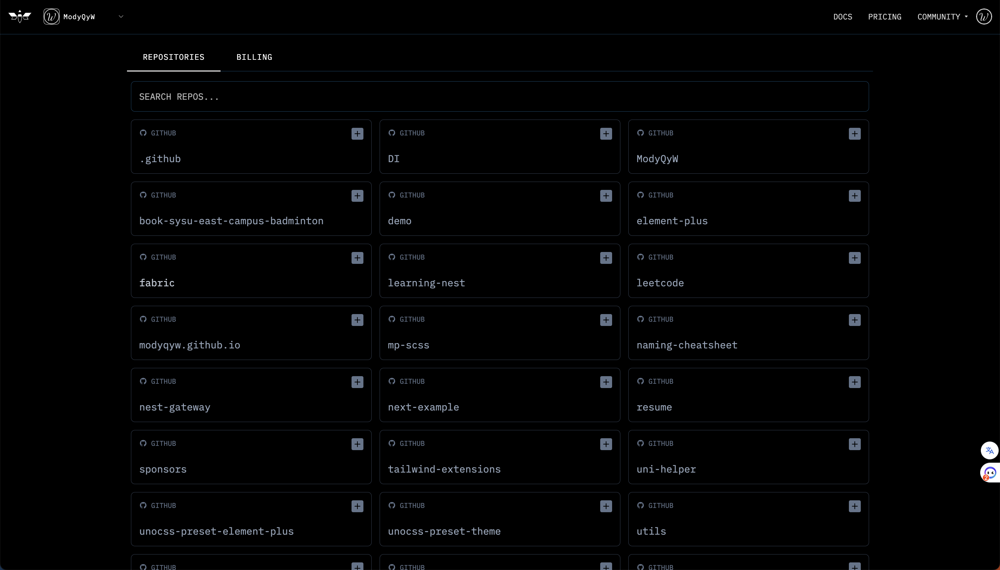

在这里，我选择使用 [unocss-preset-element-plus](https://github.com/modyqyw/unocss-preset-element-plus) 仓库来做尝试。

我在仓库内执行命令 `pnpx @cicadahq/cicada init` 做初始化，然后顺着提示完成了设置。中途会询问我是否安装 VS Code 的自动完成提示，如果选是会自动安装 `deno` 插件并设置 `.vscode/settings.json`，可以说是相当友好了。值得注意的是，如果像我一样是新安装插件，需要自己安装一下 `deno` 并重启一下 VS Code。

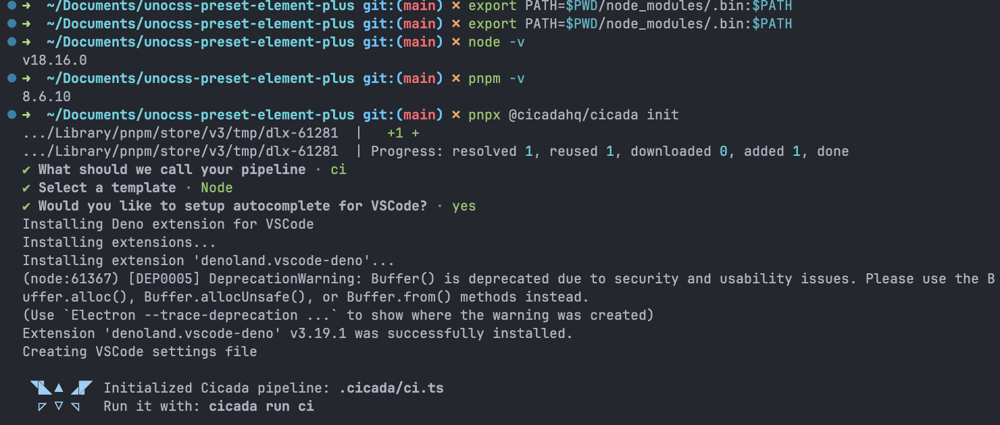

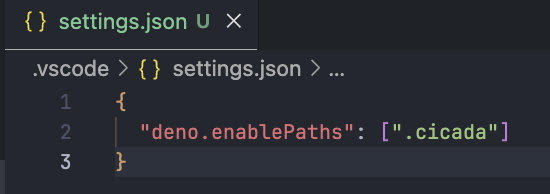

::: details 什么是 deno
deno 是一个主打安全和简单的 JS/TS 运行时。你可以在 [官网](https://deno.land/) 了解更多。
:::

我这里选择的模板是 `Node`，名字叫 `ci`，所以为我生成了 `.cicada/ci.ts` 这个文件。

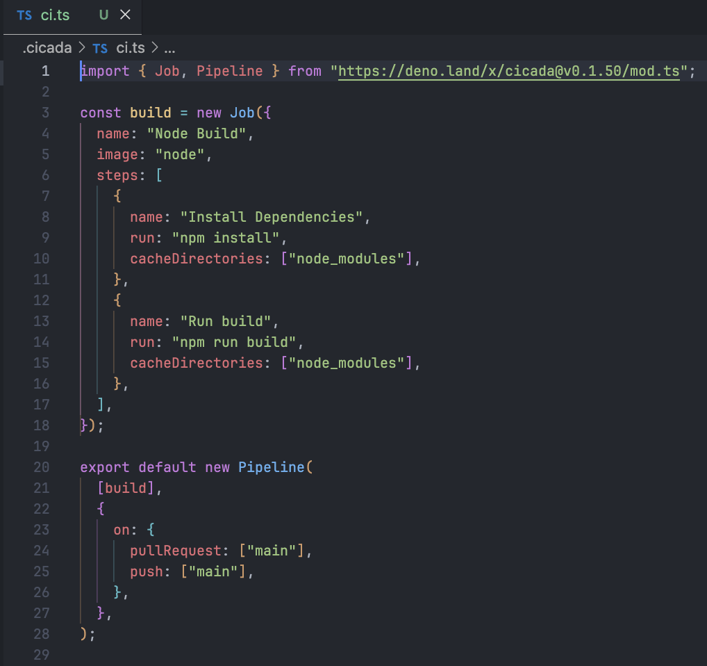

模板比较简单，可以看到它是直接从 URL 中导入模块的。比较尴尬的是，我需要手动缓存一下，否则会提示 `Uncached or missing remote URL: "https://deno.land/x/cicada@v0.1.50/mod.ts"`，而且不会有 TS 类型提示。我使用 `deno info https://deno.land/x/cicada@v0.1.50/mod.ts` 做了缓存，你也可以在 [这里](https://deno.land/manual@v1.35.2/references/vscode_deno#caching-remote-modules) 查看更多缓存说明。

模板主要用到了 `Job` 和 `Pipeline`，其中 `new Job` 所生成的实例对应 GitHub Actions 下 Jobs 的某一项，`new Pipeline` 所生成的实例对应 GitHub Actions 配置文件。这里不再赘述相关内容。

接下来自然是要把模板改造成实际可用的 Pipeline 了。这里我打算把它改造成仓库里负责检查和测试的 GitHub Action，以下就是这个 GitHub Action 的内容。

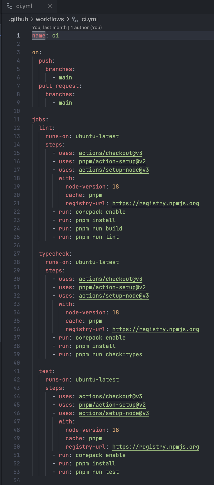

可以看到这个 GitHub Action 还是比较简单的。它会在 `main` 分支收到推送或者 PR 时触发做三项 Job，第一个是 `lint`，本质上就是配置环境后跑 `pnpm run lint`，其余两个分别是 `typecheck` 和 `test`，和第一个类似，配置环境后分别跑 `pnpm run check:types` 和 `pnpm run test`。

我们首先来实现 `lint` 相关的 Job。

我们指定 `image` 为 `node:18-alpine`，表示在 `node 18` 上运行 Job。

如果你使用过 Docker，那一定会很熟悉，在这里 cicada 就是使用 Docker 镜像来运行 Job 的。

如果你不太了解 Docker，你可以把 `image` 理解成类似于 GitHub Actions Job runs-on 的东西，不一样的是 runs-on 一般需要填写系统，比如 `ubuntu-latest`，而 `image` 可以填写更具体的运行环境，比如这里用到的 `node:18-alpine`，只要是 Docker 镜像就可以。

::: details 什么是 docker
Docker 是一个开源的应用容器引擎，让开发者可以打包他们的应用以及依赖包到一个可移植的镜像中，然后发布到流行操作系统机器上，也可以实现虚拟化。你可以在 [官网](https://www.docker.com/) 了解更多。
:::

另外指定 `cacheDirectories` 为 `["node_modules"]`，这样就可以缓存 `node_modules` 文件夹，达到优化的目的。

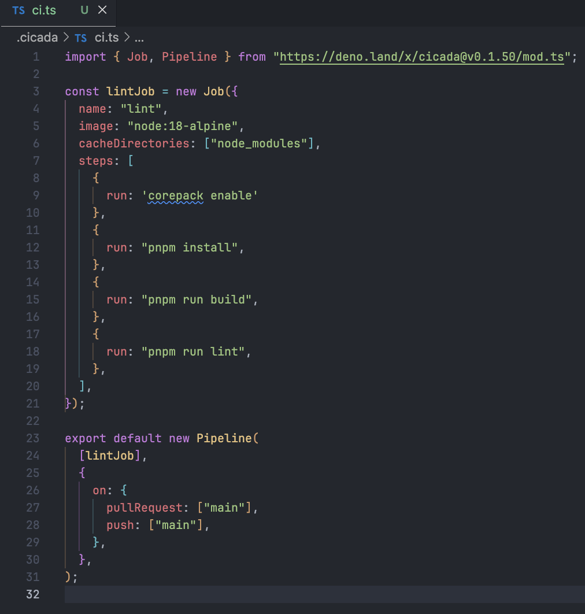

然后我们本地运行来测试一下。如果想要本地运行测试 GitHub Actions，[act](https://github.com/nektos/act) 是一个不错的选择。而 cicada 自带本地测试功能，和 `act` 一样也依赖 Docker，所以务必在测试前安装、运行 Docker。

```shell
pnpx @cicadahq/cicada run ci
```

输出日志比较长，我就不一一截图了，这里就只给出开头和结尾两部分。可以看到执行了相关命令，也有输出相关的结果，最终是成功完成。

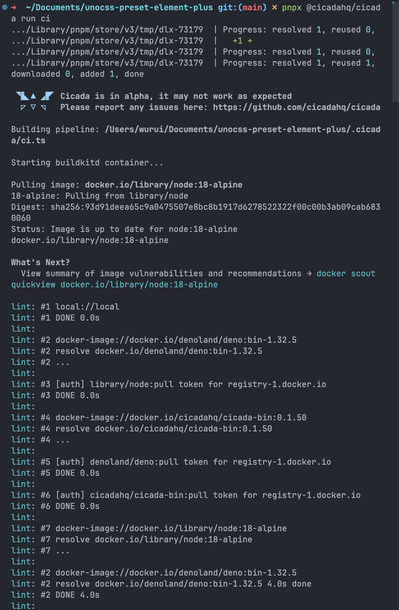

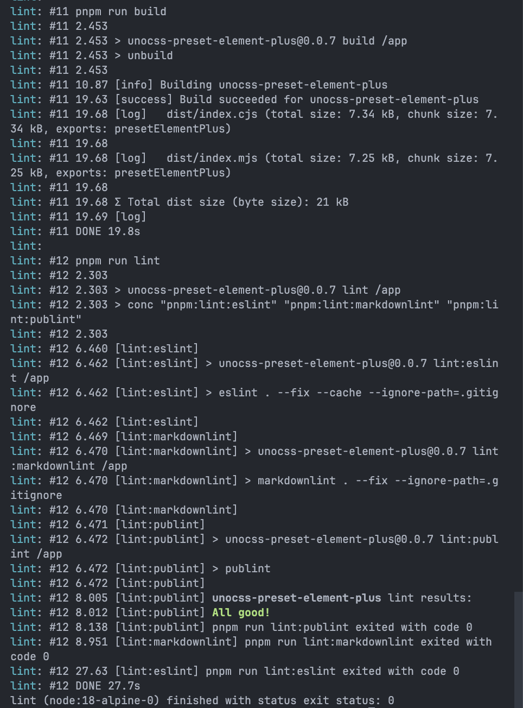

仿照已有实现，我们可以轻松地完成另外两个 Job，下面就是最终版的实现。

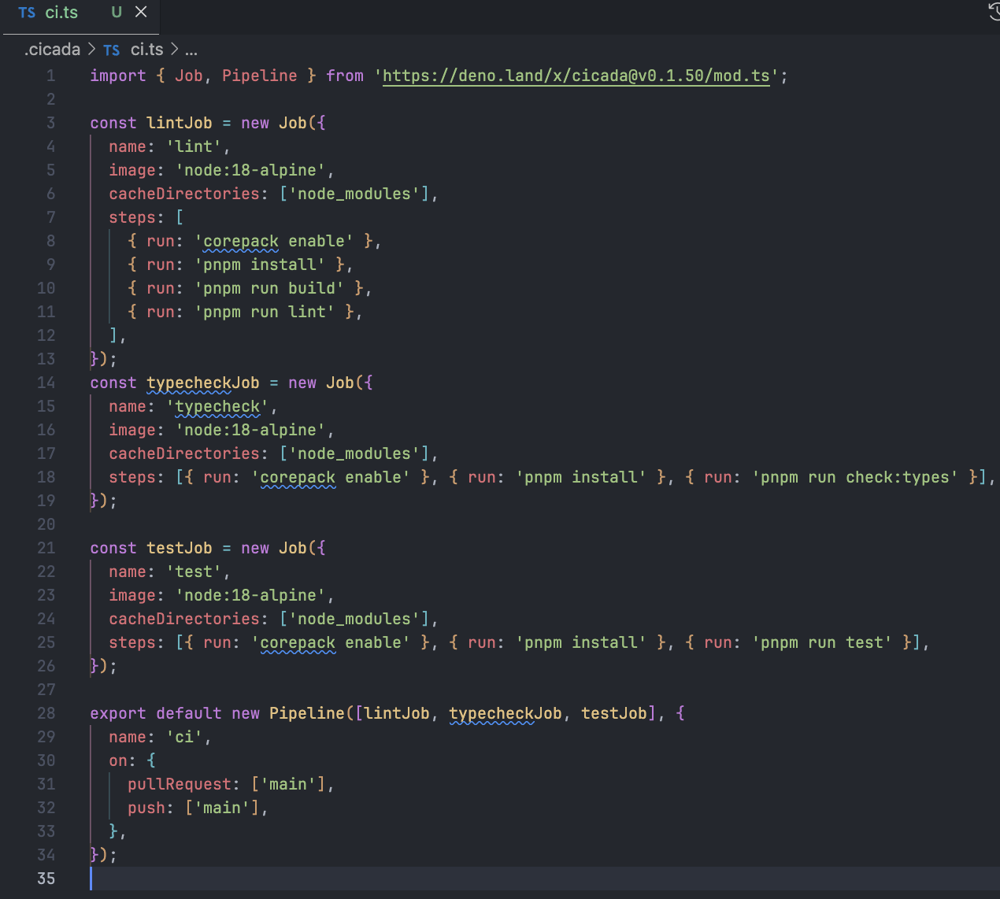

本地测试通过后，我们就可以把改动推送到仓库了。之后，我们可以到 cicada 控制台里查看。

正确配置之后，仓库显示样式会有所不同。

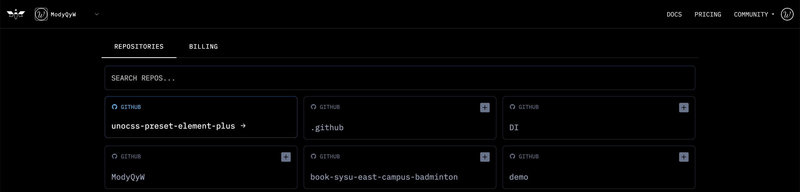

创建一个提交，控制台就会显示相关信息了。


遗憾的是，需要等待的时间实在是太久了。我等了两个多小时，还是没有运行起来，CI/CD 等这么久还不如本地跑 😅 试水也就只能到这里遗憾收场了。

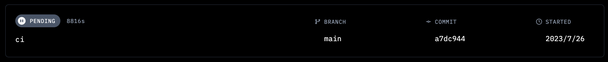

## 小结

cicada 的优势和劣势都非常明显。

优势在于，它使用 TS 来做 CI/CD Pipelines 的配置，可以使用大量 JS/TS 的特性和功能，而不必受到 YAML 的折磨。比如你想使用 GitHub Actions 里面的 matrix，你完全可以使用数组和 `Array#map` 来实现，这写在了官方的 [Example](https://cicada.build/docs/guides/pipeline-examples/jest) 内。

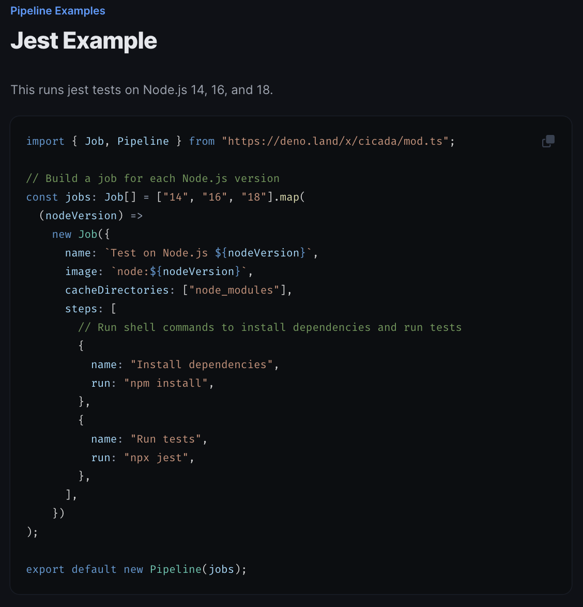

它的劣势在于成熟度不足。如果 CI/CD Pipelines 需要等待几十分钟甚至更久，远远超过本地运行的时间，那我为什么还要用它呢？本地运行不是更快更舒服吗？此外，它还没能支持并发执行 Job / Pipeline，需要联系来帮助设立自托管运行器等。


长远来看，cicada 对于我这个重度使用 JS/TS 的人来说还是很 **有吸引力** 的，但我认为 **目前不能投入实际使用**，起码没给钱的不能，玩一下得了。
