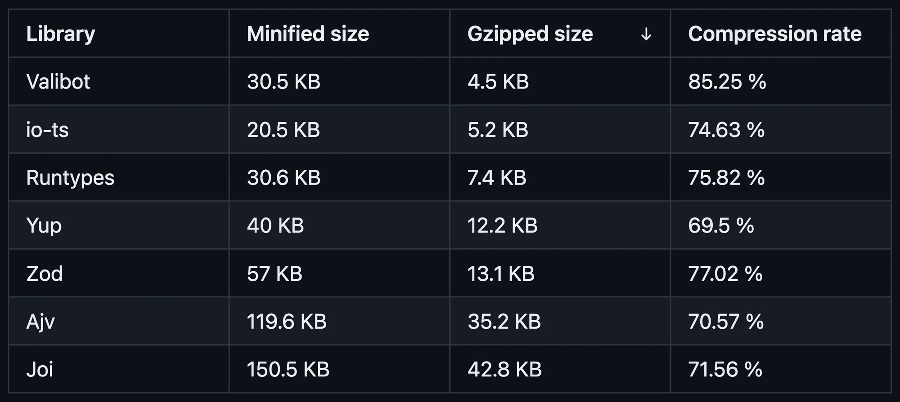

# 全新 schema 校验工具 valibot

提到 schema 校验工具，第一时间你会想到什么？是后起之秀 [zod](https://zod.dev/)，是最老牌的 [joi](https://joi.dev/)，还是大部分人没有听过的 [yup](https://github.com/jquense/yup) 和 [ajv](https://ajv.js.org/)？

现在你有了一个新选择！就在前不久，一个全新 schema 校验工具 [valibot](https://valibot.dev/) 发布了，号称小于 1kb 的 zod 替代品，对标 joi、yup、ajv 和 zod。


## 用法

valibot 的用法很简单，和 zod 非常相似。

### schema

valibot 核心功能在于创建一个类似于 TypeScript 类型定义的 schema。

你可以为原始值创建相应的 schema。由于保留字的影响，部分方法添加了 `Type` 后缀。

```typescript
const BigintSchema = bigint(); // bigint
const BooleanSchema = boolean(); // boolean
const NullSchema = nullType(); // null
const NumberSchema = number(); // number
const StringSchema = string(); // string
const SymbolSchema = symbol(); // symbol
const UndefinedSchema = undefinedType(); // undefined
```

当然，你也可以为其它值创建相应的 schema，包括 Array、Blob、Date、Map、Set、Object、Tuple 等。

```typescript
const ArraySchema = array(string()); // string[]
const BlobSchema = blob(); // Blob
const DateSchema = date(); // Date
const MapSchema = map(string(), number()); // Map<string, number>
const ObjectSchema = object({ key: string() }); // { key: string }
const RecordSchema = record(number()); // { [key: string]: number }
const SetSchema = set(number()); // Set<number>
const TupleSchema = tuple([string(), number()]); // [string, number]
```

除此之外，valibot 还可以让你创建一些你可能意想不到的 schema！

```typescript
const AnySchema = any(); // any
const EnumSchema = enumType(['a', 'b']); // 'a' | 'b'
const NanSchema = nan(); // NaN
const NeverSchema = never(); // never
const NullableSchema = nullable(string()); // string | null
const NullishSchema = nullish(string()); // string | null | undefined
const OptionalSchema = optional(string()); // string | undefined
const NonNullableSchema = nonNullable(nullable(string())); // string
const NonNullishSchema = nonNullish(nullish(string())); // string
const NonOptionalSchema = nonOptional(optional(string())); // string
const UnionSchema = union([string(), number()]); // string | number
const UnknownSchema = unknown(); // unknown
const VoidSchema = voidType(); // void
```

相信你一定感受到了，schema 和 TypeScript 类型定义实在太相似了。不同点在于，前者会实际执行以保证未知数据（比如服务器接口返回的数据）的类型安全，后者不会实际执行，提供了更好的开发者体验，编译时会移除。

```typescript
import { object, string } from 'valibot';

// TypeScript 类型定义，编译时移除
type LoginForm = {
  email: string;
  password: string;
};

// valibot，保留到运行时
const LoginSchema = object({
  email: string(),
  password: string(),
});
```

### pipeline

在某些情况下，你可能需要对 schema 进行额外的验证，这个时候你只需要将 pipeline 方法数组作为 schema 的最后一个参数传入。

```typescript
import { email, endsWith, string } from 'valibot';

// 先检查是不是 email 地址
// 再检查是不是以 @example.com 结尾
const EmailSchema = string([email(), endsWith('@example.com')]);
```

你也可以借助 pipeline 和 valibot 提供的方法对输入值进行简单处理，比如使用 `toTrimmed` 去除首尾空格，使用 `minValue` 设置 Number 最小值等。

```typescript
import { email, endsWith, string, toTrimmed } from 'valibot';

// 和上一个例子相比，增加了 toTrimmed 以去除首尾空格
// 然后检查是不是 email 地址
// 再检查是不是以 @example.com 结尾
const EmailSchema = string([toTrimmed(), email(), endsWith('@example.com')]);
```

valibot 自然也提供了自定义验证方法，你完全可以自定义自己的验证方法。但为了避免混乱，建议尽量使用 valibot 提供的验证方法。

```typescript
import { customAsync, stringAsync } from 'valibot';
import { isAvailableUsername } from '~/api';

const UsernameSchema = stringAsync([
  customAsync(isAvailableUsername, 'This username is already taken.'),
]);
```

### 验证数据

创建了 schema 之后，我们可以拿着 schema 来验证数据，保证类型安全。

最简单的方式就是使用 `parse` 或者 `parseAsync` 方法。你需要使用 `try {...} catch {...}` 来捕获可能出现的错误。

```typescript
import { email, parse, string } from 'valibot';

try {
  const EmailSchema = string([email()]);
  const email = parse(EmailSchema, 'jane@example.com');
} catch (error) {
  console.log(error);
}
```

在某些时候，你可能只想知道数据和 schema 是否匹配，而不关心完整错误，这时你可以设置 `abortEarly` 为 `true`，发现第一个问题后立即中止验证，以提高性能。

```typescript
import { object, parse, string } from 'valibot';

try {
  const ProfileSchema = object({
    name: string(),
    bio: string(),
  });
  const profile = parse(
    ProfileSchema,
    { name: 'Jane', bio: '' },
    { abortEarly: true }
  );
} catch (error) {
  console.log(error);
}
```

如果你不想使用 `try {...} catch {...}`，那可以使用 `safeParse` 或 `safeParseAsync`。返回结果的 success 表示是否成功，data 表示 schema 验证后的输出，error 表示验证期间的错误。

```typescript
import { email, safeParse, string } from 'valibot';

const EmailSchema = string([email()]);
const result = safeParse(EmailSchema, 'jane@example.com');

if (result.success) {
  const email = result.data;
} else {
  console.log(result.error);
}
```

### 推断类型

你可以轻松地根据 schema 推断输入类型，只需要使用提供的 `Input` 类型。

```typescript
import { type Input, object, string } from 'valibot';

const LoginSchema = object({
  email: string(),
  password: string(),
});
// { email: string; password: string }
type LoginInput = Input<typeof LoginSchema>; 
```

大部分时候，输入和输出类型是一致的。如果你使用了 `transform` 或 `transformAsync` 来转换了值类型，就需要使用提供的 `Output` 类型来推断输出类型。

```typescript
import { object, type Output, string } from 'valibot';
import { hashPassword } from '~/utils';

const LoginSchema = transform(
  object({
    email: string(),
    password: transform(string(), hashPassword),
  }),
  // 在这里处理输入值
  (input) => {
    return {
      ...input,
      // 增加了 timestamp 属性
      timestamp: new Date().toISOString(),
    };
  }
);
 // { email: string; password: string; timestamp: string }
type LoginOutput = Output<typeof LoginSchema>;
```

## 创新

valibot 有两个创新点，一个是 API 的模块化设计，另一个是源代码的优化压缩。

从前面介绍用法，你应该也感受到，valibot 是基于许多小型独立的方法来使用的，每个方法只执行一个任务。

首先，你可以使用外部代码轻松扩展功能。其次，这使得 valibot 更加健壮和安全，因为可以通过单元测试更轻松地测试各个方法的功能以及特殊边缘情况。

最重要的，打包工具可以通过摇树优化删除掉所有不需要的代码。这有利于减小包大小，提高性能。比如，要验证简单的登录表单，zod 需要 11.51 KB，而 valibot 仅需要 0.7 KB，包大小足足减少了 94%！

```typescript
import { email, minLength, object, string } from "valibot"; // 0.7 KB

const LoginSchema = object({
  email: string([
    minLength(1, "Please enter your email."),
    email("The email address is badly formatted."),
  ]),
  password: string([
    minLength(1, "Please enter your password."),
    minLength(8, "You password must have 8 characters or more."),
  ]),
});
```

```typescript
import { object, string } from "zod"; // 11.51 KB

// min、email 等附加方法影响了包大小
const LoginSchema = object({
  email: string()
    .min(1, "Please enter your email.")
    .email("The email address is badly formatted."),
  password: string()
    .min(1, "Please enter your password.")
    .min(8, "You password must have 8 characters or more."),
});
```

valibot 的整体包大小也更小一些，它的源代码结构相对简单，复杂度相对较低，更针对压缩进行了优化。



## 关于作者

valibot 的作者是 Fabian Hiller，他同时也是 [modular-forms](https://github.com/fabian-hiller/modular-forms) 的作者。

作为他学士论文的一部分，他在老师的指引下研究了不同的 schema 库，并从头开发了 valibot。相比之下，我感觉我好菜啊 😭

## 总结

valibot 确实让我眼前一亮，以 zod 作为参照物，在包大小和性能上发力，这是一个非常不错的开始。

它的劣势也非常明显，那就是成熟度依然不够。

截至本文写完，valibot 的最新版本是 0.8.0，还没有到达稳定。有 ReactNative 在前，你也不知道 valibot 什么时候才会稳定。

zod 有 trpc、react-hook-form 等等已经落地的实践，而 valibot 还没能看到一个成熟落地实践。

目前只建议在个人小项目或者短期项目里尝试使用 valibot。
