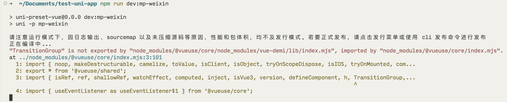
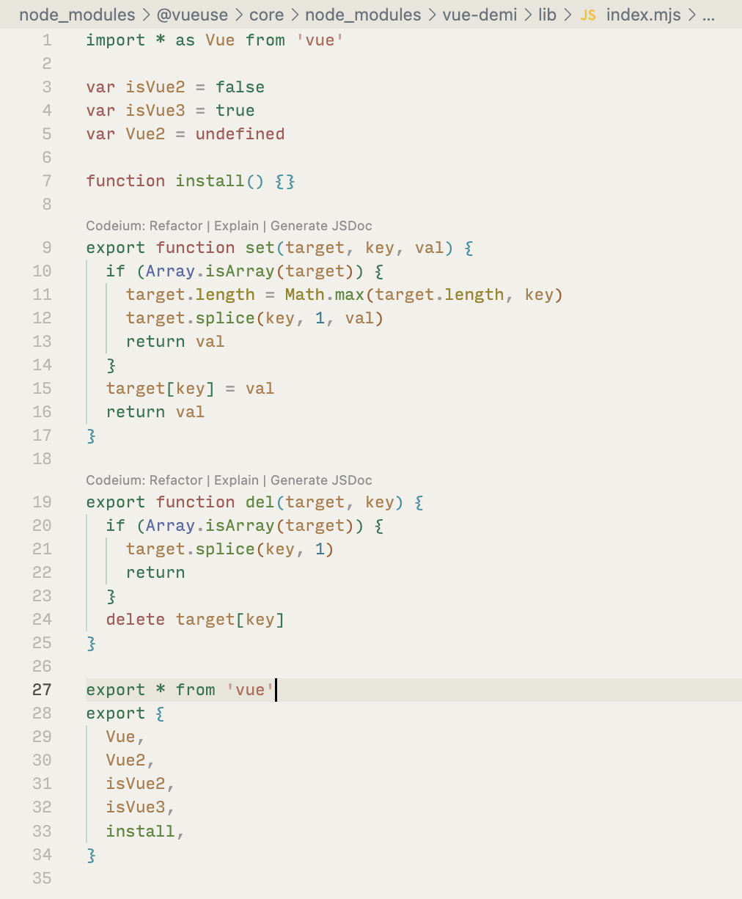
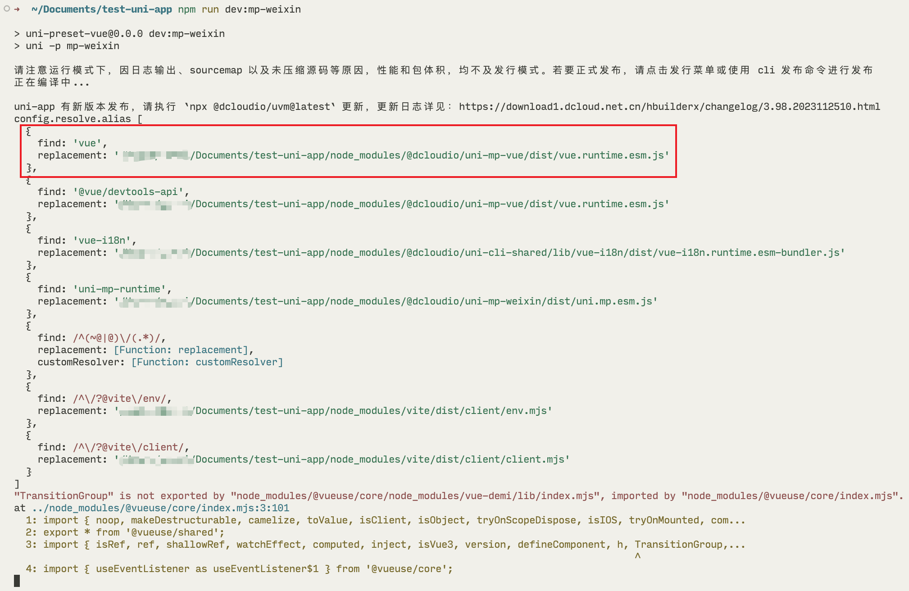
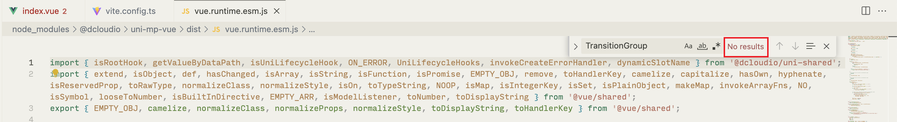
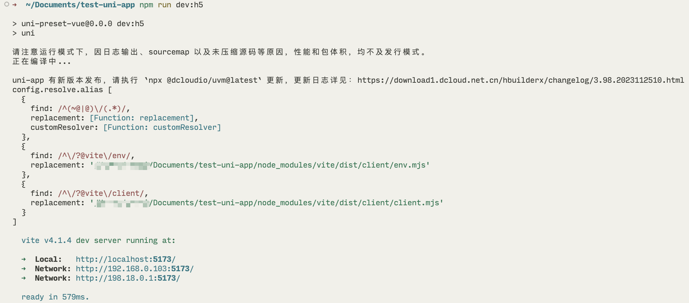
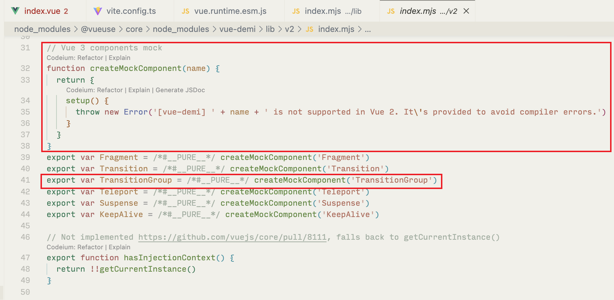
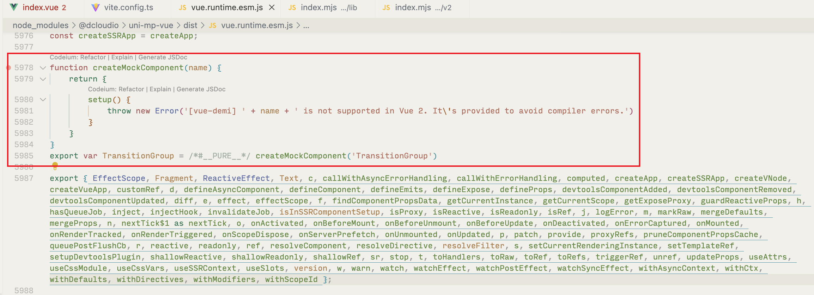
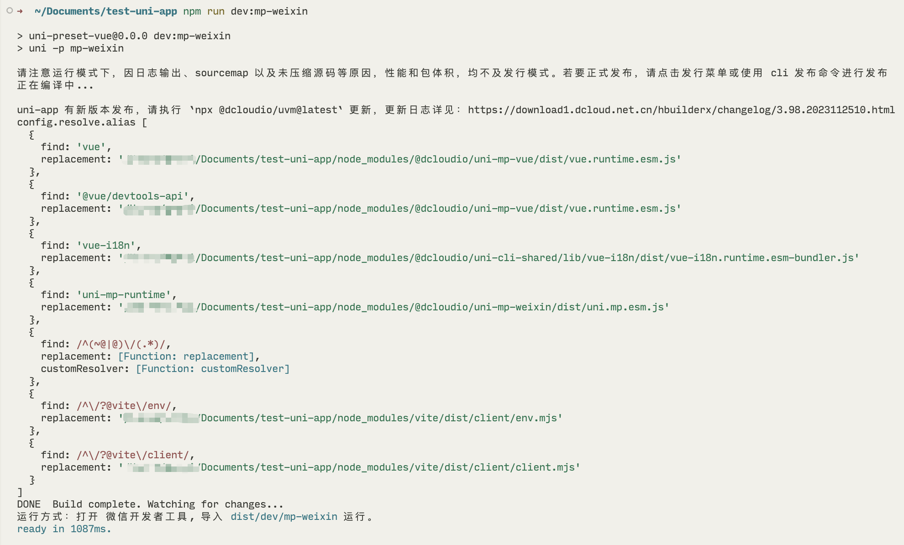
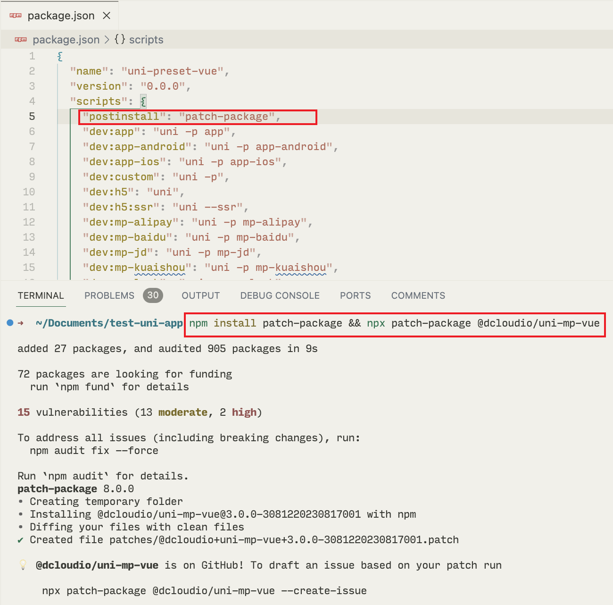

# 为什么 uni-app (vue3) 和 @vueuse/core v10 一起用会报错？

## 背景

在 @vueuse/core v10 正式发布之后，我尝试在 uni-app (vue3) 上使用，结果却是报错，无法正常报错。当时时间不够，降级到 v9 就当是处理完了。最近有一点空闲时间，重新探究了一下这个问题。

## 复现

首先检查一下自己的配置。

```shell
➜  npx envinfo --system --binaries --browsers

  System:
    OS: macOS 14.1.1
    CPU: (10) arm64 Apple M2 Pro
    Memory: 60.13 MB / 16.00 GB
    Shell: 5.9 - /bin/zsh
  Binaries:
    Node: 20.9.0 - ~/Library/Caches/fnm_multishells/59383_1701323322626/bin/node
    Yarn: 1.22.19 - ~/Library/Caches/fnm_multishells/59383_1701323322626/bin/yarn
    npm: 10.1.0 - ~/Library/Caches/fnm_multishells/59383_1701323322626/bin/npm
    pnpm: 8.6.0 - ~/Library/Caches/fnm_multishells/59383_1701323322626/bin/pnpm
    bun: 1.0.14 - /opt/homebrew/bin/bun
    Watchman: 2023.11.27.00 - /opt/homebrew/bin/watchman
  Browsers:
    Chrome: 119.0.6045.159
    Safari: 17.1

```

拉取 uni-app 官方的 vue3 模板，安装依赖。

```shell
npx degit dcloudio/uni-preset-vue#vite-ts test-uni-app
cd test-uni-app
npm install @vueuse/core
```

更新 `src/pages/index/index.vue`，引入 @vueuse/core。

```vue
<template>
  <view class="content">
    <image class="logo" src="/static/logo.png" />
    <view class="text-area">
      <text class="title">{{ title }}</text>
    </view>
  </view>
</template>

<script setup lang="ts">
import { ref } from 'vue'
import { createGlobalState } from '@vueuse/core' // [!code ++]

const useGlobalState = createGlobalState( // [!code ++]
  () => { // [!code ++]
    const count = ref(0) // [!code ++]
    return { count } // [!code ++]
  } // [!code ++]
) // [!code ++]
const title = ref('Hello')
</script>

<style>
.content {
  display: flex;
  flex-direction: column;
  align-items: center;
  justify-content: center;
}

.logo {
  height: 200rpx;
  width: 200rpx;
  margin-top: 200rpx;
  margin-left: auto;
  margin-right: auto;
  margin-bottom: 50rpx;
}

.text-area {
  display: flex;
  justify-content: center;
}

.title {
  font-size: 36rpx;
  color: #8f8f94;
}
</style>

```

运行到微信小程序，就会报错。

```shell
npm run dev:mp-weixin
```



## 探究

我们可以看到错误信息内有这么一句：`"TransitionGroup" is not exported by "node_modules/@vueuse/core/node_modules/vue-demi/lib/index.mjs", imported by "node_modules/@vueuse/core/index.mjs".`。

翻译过来就是说，@vueuse/core 从 vue-demi 导入了 `TransitionGroup`，但是 vue-demi 没有导出 `TransitionGroup`，这就导致了 @vueuse/core 无法正常使用。那我们就来看看 vue-demi 里面到底做了些什么。



可以看到 vue-demi 里面没有什么神秘的代码，理论上 L27 确实正常导出 `TransitionGroup`。但事实是，`TransitionGroup` 确实没有导出。那我们只能怀疑，uni-app 运行到微信小程序时，使用的并非是 vue 官方库，而是通过 vite 的 [resolve.alias](https://cn.vitejs.dev/config/shared-options.html#resolve-alias) 配置指向了一个修改过的 vue 库。

我们可以在 vite 配置文件内增加一个插件来验证这一点是否正确。

```typescript
import { defineConfig } from "vite";
import uni from "@dcloudio/vite-plugin-uni";

// https://vitejs.dev/config/
export default defineConfig({
  plugins: [
    uni(),
    {// [!code ++]
      name: "test",// [!code ++]
      configResolved(config) {// [!code ++]
        console.log("config.resolve.alias", config.resolve.alias);// [!code ++]
      },// [!code ++]
    },// [!code ++]
  ],
});

```

再次运行到微信小程序，查看输出。可以看到确实设置了 `resolve.alias`，将 vue 指向了 @dcloudio/uni-mp-vue 内的文件。



我们进入该文件内搜索，可以看到没有结果。因此可以确定问题的根源在于 uni-app 修改了 vue 库并用于微信小程序，修改过的 vue 库没有导出 `TransitionGroup`，所以在使用 @vueuse/core v10 时会出现报错。



而运行到 H5 则不会报同样的错误，因为此时使用的是 vue 官方库。



## 解决方案

正如我在开头提到的，降级到 v9 是一个解决方案，因为 @vueuse/core v9 还没有用到 `TransitionGroup`。

但是停留在 v9 就没有办法使用各种修复和新特性了，有没有什么办法可以处理这个问题呢？

答案还是出自于 vue-demi。vue v2 没有 `TransitionGroup`，vue-demi 为它模拟了一个 `TransitionGroup`，使得 @vueuse/core v10 可以在 vue v2 上正常使用。



我们可以参考这种做法，为修改过的 vue 库补充 `TransitionGroup` 的模拟。



再运行到微信小程序，可以看到现在不会报错了。在微信小程序开发者工具上也能正常打开。



为了让团队伙伴也能享受到这个修复，不要忘了创建一个 patch。如果你使用的包管理器支持 `patch` 命令，可以直接使用，如果不支持，可以使用 [patch-package](https://github.com/ds300/patch-package)。



但无论使用 `patch` 命令，还是使用 patch-package，都属于临时解决方案。最好的解决方案还是 uni-app 官方在修改过的 vue 库内增加导出，这样就不需要用户侧做这个修复操作了。目前已经提交了 [issue](https://github.com/dcloudio/uni-app/issues/4604) 并得到了官方回应，期待这个问题早日解决！🙏

## 一个小广告

@vueuse/core v10 官方并没有支持小程序平台，所以有不少特性不能在小程序上直接使用。来看看 [@uni-helper/uni-use](https://github.com/uni-helper/uni-use) 吧，希望它能给你更好的 uni-app 开发体验！
