# VXETable 中嵌套 ElementPlus Form 导致的表单校验问题分析与解决

## 背景

在过往 Vue 3 业务中，VXETable 虚拟滚动表格中嵌套 ElementPlus Form 表单时，会出现表单校验不正确的问题。

业务中使用 [ElementPlus](https://element-plus.org/) 作为基本组件库。业务需求是在一个表格中嵌套表单，展示数据，并允许数据修改，具体如下：

1. 回显数据有 200 条以上；
2. 可以新增单条数据；
3. 每条数据有 6 个字段允许修改；
4. 提交时需要校验。

如果直接使用 ElementPlus 的 Table 组件来作为表格，一次性渲染全部元素，进而导致一次性绑定全部事件（200 * 6 = 1200，也就是至少需要绑定 1200 个事件），需要的时间太长，用户体验非常差（快的话需要 3 秒，慢的话需要几分钟乃至十分钟以上）。因此，需要引入虚拟滚动来避免一次性渲染全部元素。

ElementPlus 的 Table 组件不支持虚拟滚动。TableV2 组件仍在测试中，生产环境使用可能有风险，领导不能接受这一点😅。因此我们选型最终选择了 [VXETable](https://vxetable.cn/)。

## 复现

以下是一个可供复现的示例。示例中，数据是伪造得到的。

TypeScript 部分：

```vue
<script setup lang="ts">
import { ref } from 'vue';
import { ElMessage } from 'element-plus';
import type { FormRules, FormInstance } from 'element-plus';

// 伪造下拉选择框数据
const selectOptions = Array.from({ length: 20 }).map((_, index) => ({
  label: index,
  value: index,
}));
// 默认单条数据数据
const INITIAL_ITEM = {
  field1: undefined,
  field2: undefined,
  field3: undefined,
  field4: undefined,
  field5: undefined,
  field6: undefined,
};

// 表单引用
const formRef = ref<FormInstance>();
// 表单数据类型
interface FormModel {
  data: {
    field1: number | undefined;
    field2: number | undefined;
    field3: number | undefined;
    field4: number | undefined;
    field5: number | undefined;
    field6: string | undefined;
  }[];
}
// 伪造表单数据
const formModel = ref<FormModel>({
  data: Array.from({ length: 200 }).map((_, index) => ({
    field1: index % 20,
    field2: index % 20,
    field3: index % 20,
    field4: index % 20,
    field5: index % 20,
    field6: 'Lorem',
  })),
});
// 表单规则
const formRules: FormRules = {
  select: {
    required: true,
    message: 'Please select',
    trigger: 'change',
  },
  input: {
    required: true,
    message: 'Please input',
    trigger: 'change',
  },
};

// 新增一条数据
const handleAdd = () => {
  formModel.value.data.unshift({ ...INITIAL_ITEM });
};

// ElForm 校验
const handleFormValidate = async () => {
  if (!formRef.value) return false;
  return await formRef.value.validate().catch(() => false);
};
// 提交
const handleSubmit = async () => {
  const isValid = await handleValidate();
  if (!isValid) return ElMessage.error('Invalid');
  ElMessage.success('Valid');
  // 略过实际提交逻辑
};
</script>
```

Template 部分：

```vue
<template>
  <el-form ref="formRef" :model="formModel">
    <!-- 操作 -->
    <el-form-item>
      <el-col style="text-align: right">
        <el-space>
          <el-button @click="handleAdd">新增一行</el-button>
          <el-button type="primary" @click="handleSubmit">提交</el-button>
        </el-space>
      </el-col>
    </el-form-item>
    <!-- 表格 -->
    <vxe-table
      max-height="512px"
      :scroll-y="{ enabled: true, gt: 0, scrollToTopOnChange: true }"
      :row-config="{ isHover: true, height: 72 }"
      :column-config="{ isHover: true }"
      :show-overflow="false"
      :data="formModel.data"
    >
      <!-- 循环渲染，简化例子 -->
      <vxe-column min-width="128px" v-for="n of 6" :key="n">
        <!-- 提示必填 -->
        <template #header>
          Field{{ n }} <span style="color: red">*</span>
        </template>
        <template #default="{ row, rowIndex }">
          <!-- 渲染 5 个 select -->
          <el-form-item
            v-if="n !== 6"
            :prop="`data.${rowIndex}.field${n}`"
            :rules="formRules.select"
          >
            <el-select v-model="row[`field${n}`]" filterable>
              <el-option
                v-for="option of selectOptions"
                :key="option.value"
                :label="option.label"
                :value="option.value"
              ></el-option>
            </el-select>
          </el-form-item>
          <!-- 渲染 1 个 input -->
          <el-form-item
            v-else
            :prop="`data.${rowIndex}.field${n}`"
            :rules="formRules.input"
          >
            <el-input v-model="row[`field${n}`]" clearable></el-input>
          </el-form-item>
        </template>
      </vxe-column>
    </vxe-table>
  </el-form>
</template>
```

你可以直接拉取 [代码](https://github.com/ModyQyW/vxe-table-element-plus-form-validate) 到本地运行。运行起来后如下图。

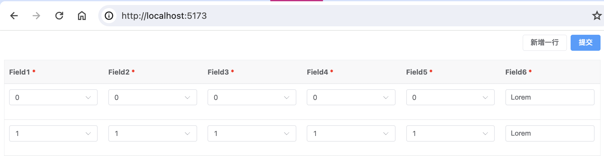

点击“新增一行”按钮后，会在表格中新增一行，并显示相应的提示信息。此时提交不能通过校验。

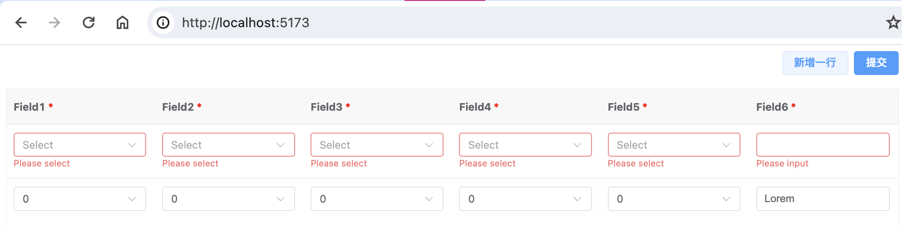

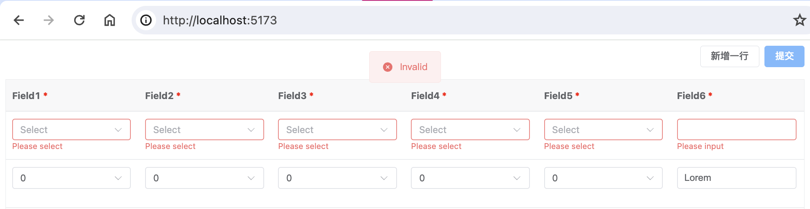

但是，如果往下滚动多一点，再点击“提交”按钮，此时又能通过校验。

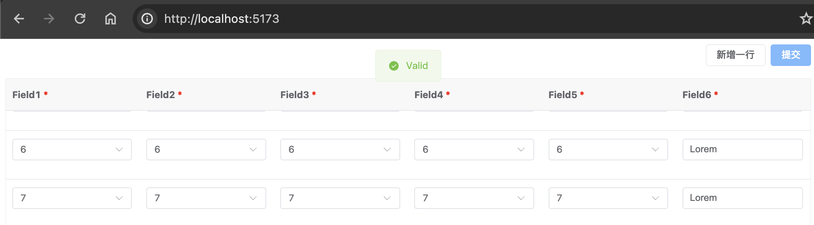

期望表现是点击“新增一行”按钮后，无论是否滚动，直接点击“提交”按钮都不能通过校验。这与期望表现不符合。

## 分析

通过控制变量，我们很容易确认是滚动导致了问题，进而很容易猜测是 VXETable 的虚拟滚动功能导致了问题。

我们可以修改 `<vxe-table>` 的 `scroll-y` 属性来验证一下，我们将 `enabled` 设置成 `false` 强制禁用虚拟滚动，会发现卡顿明显了不少，而且滚动后再点击“提交”按钮不能通过校验。如果换回 ElTable，卡顿感会更为明显，同样地，滚动后再点击“提交”按钮不能通过校验。这就可以确认问题根源是 VXETable 的虚拟滚动功能。

前面提到，我们引入虚拟滚动来避免一次性渲染全部元素，进而实现优化，这也就是虚拟滚动的核心：减少元素渲染。


> 图源：<https://github.com/dwqs/blog/issues/70>

我们打开开发者工具来查看，可以看到开启虚拟滚动后，VXETable 一次只渲染了 10 条数据。

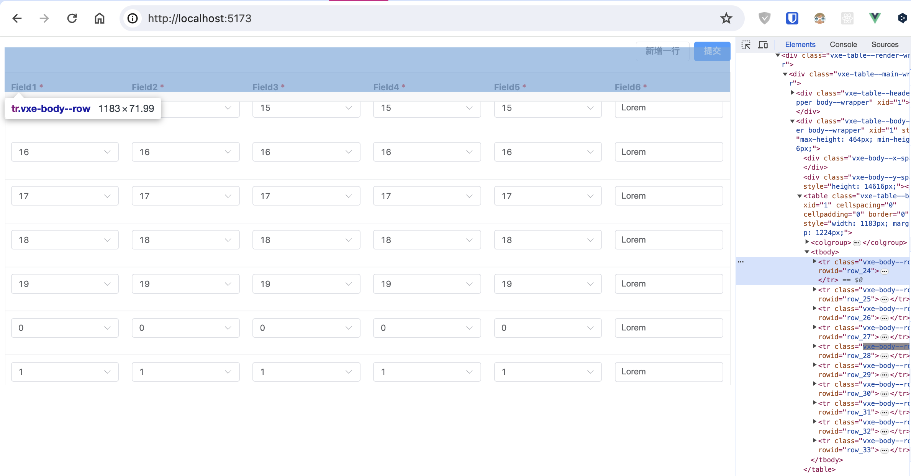

而关闭虚拟滚动后，VXETable 一次渲染了全部数据。

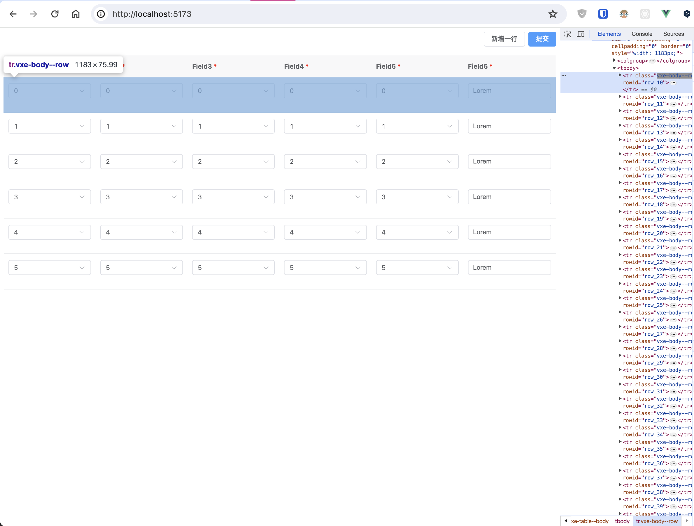

开启虚拟滚动导致一次只渲染了部分数据，为什么就导致了 ElForm 校验不正常呢？难道说 ElForm 校验只针对渲染出来的数据吗？我们去扒一扒 ElementPlus 源码。

我们在 [element-plus/packages/components/form/src/form.vue](element-plus/blob/2.5.5/packages/components/form/src/form.vue) 中找到 ElForm 实例上的 `validate` 方法。

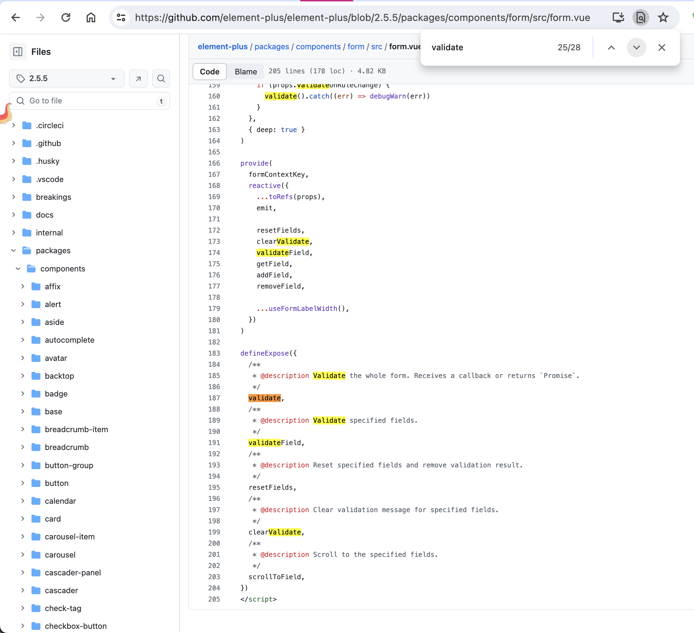

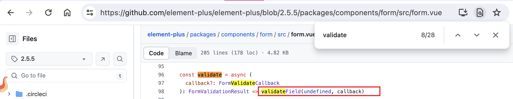

`validate` 方法直接返回了 `validateField` 的调用结果，那我们就再去找 `validateField`。

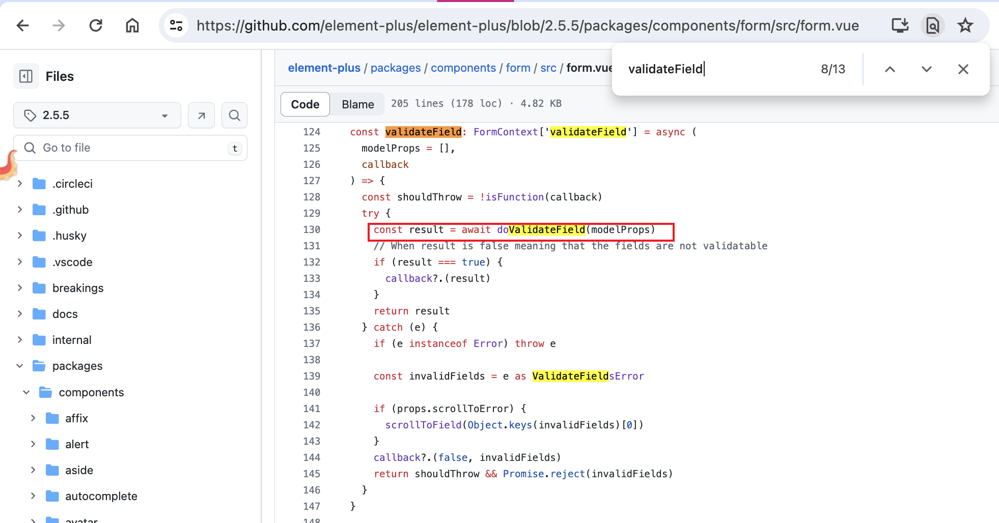

`validateField` 方法里面调用了 `doValidateField` 方法获取 result，那我们就再去找 `doValidateField`。

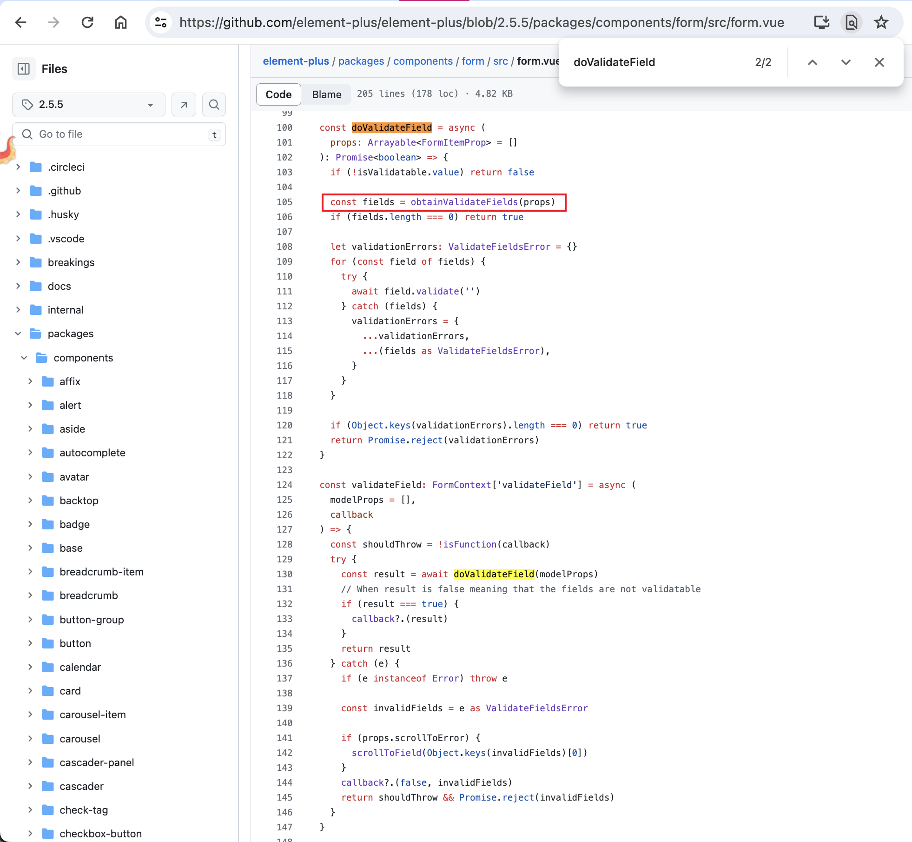

`doValidateField` 方法里面调用了 `obtainValidateFields` 方法来获取需要校验的字段，看起来不是所有字段都会被检验的。我们继续找到 `obtainValidateFields`。

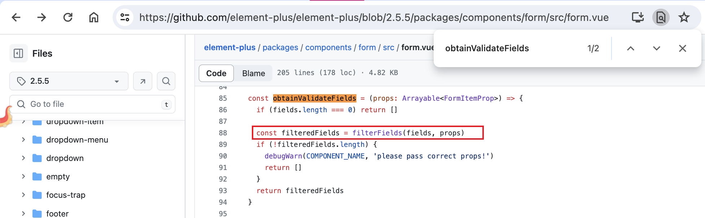

`obtainValidateFields` 方法里面调用了 `filterFields` 方法来过滤掉不需要校验的字段。我们可以在 [element-plus/packages/components/form/src/utils.vue](element-plus/blob/2.5.5/packages/components/form/src/utils.vue) 中找到这个方法。

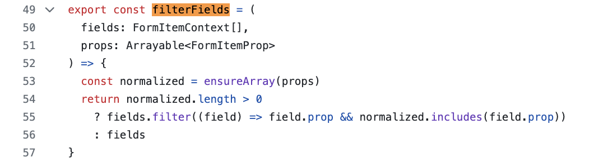

props 这个参数是从 `validate` 方法传递下来的，`validate` 将 undefined 传给 `validateField`，值被修改为空数组。然后 `validateField` 依次传给 `doValidateField`、`obtainValidateFields`、`filterFields`，期间没有其它修改。也就是说，`filterFields` 中接收到的 props 参数取值是空数组，`filterFields` 方法应该会直接返回传入的 `fields`。

那 `fields` 取值是什么？我们可以看到，`fields` 是 `form.vue` 内定义的局部变量，而且 `form.vue` 里面没有看到直接操作 `fields` 的地方。

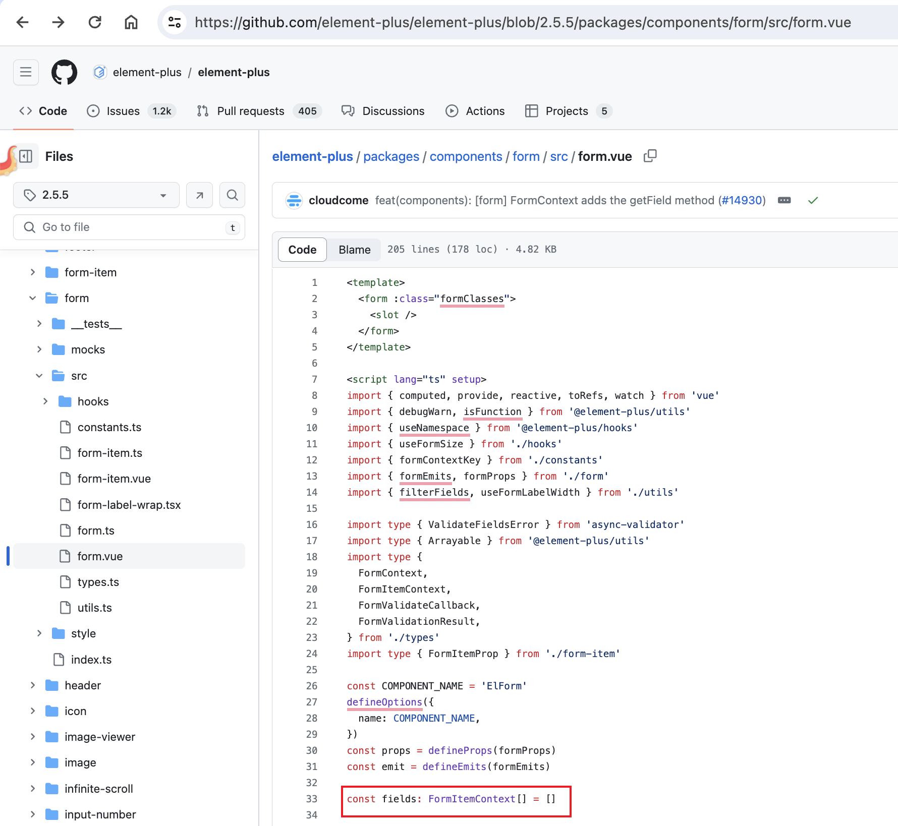

但是，`form.vue` 使用 `provide` 提供了操作 `fields` 的方法。我们可以猜测是 ElForm 的子组件调用相关的方法操作了 `fields`。

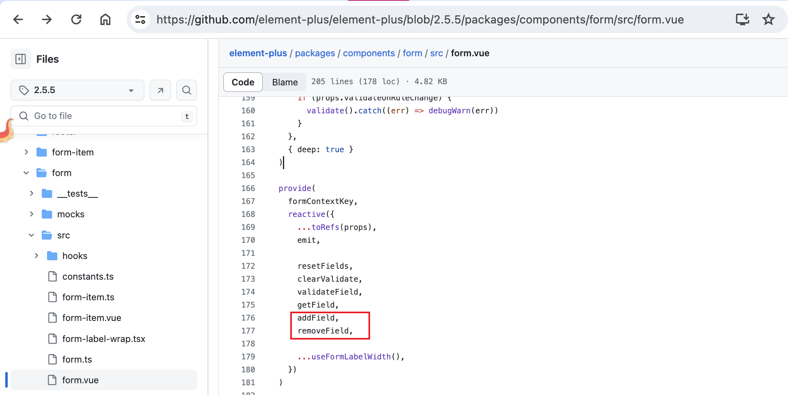

顺着这个思路，我们在 [element-plus/packages/components/form/src/form-item.vue](element-plus/blob/2.5.5/packages/components/form/src/form.vue) 中找到了相关逻辑。

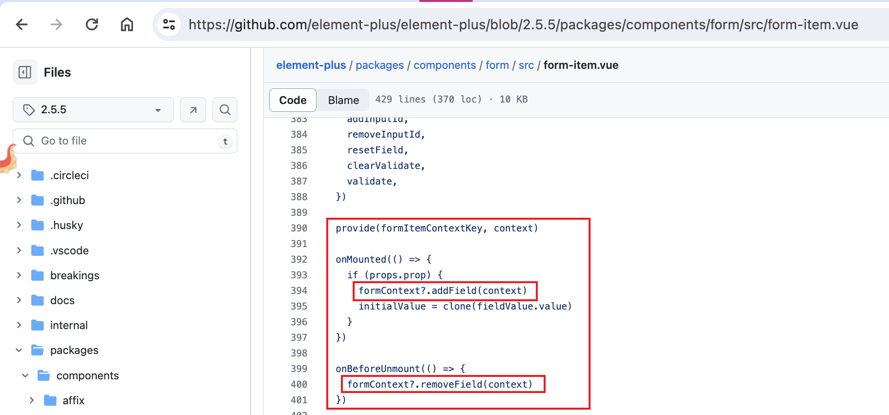

现在可以确认，ElForm 校验只针对渲染出来的数据。官网文档说的是 `对整个表单的内容进行验证`，这个表述可能会造成一点误解。

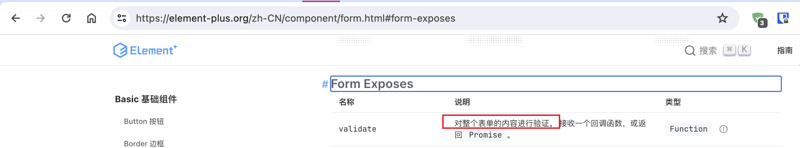

开启虚拟滚动导致一次只渲染部分数据，ElForm 校验只针对渲染出来的数据，这两者组合起来就是这个问题的根源原因。

## 解决

要解决这个问题，最简单的方法就是自己手动跑一次校验。在这个例子里，可以这样写。

```typescript
// 自定义校验
const handleCustomValidate = () => {
  const index = formModel.value.data.findIndex(
    (item) =>
      !item.field1 ||
      !item.field2 ||
      !item.field3 ||
      !item.field4 ||
      !item.field5 ||
      !item.field6
  );
  return index === -1;
};
// 提交
const handleSubmit = () => {
  const isValid = handleCustomValidate();
  if (!isValid) return ElMessage.error("Invalid");
  ElMessage.success("Valid");
  // 略过实际提交逻辑
};
```

这样看起来可以了，如果有必要可以再封装一下校验方法。但我觉得还差了点意思，不如你先思考一下再往下看。

我的想法是，功能逻辑上满足了需求，用户体验还是比较差的。既然有错误，为什么不滚动到对应的地方呢？还要我们的用户手动找吗？在这个例子里，我们可以使用 VXETable 提供的方法滚动到对应的行。

首先需要给 `<vxe-table>` 添加 ref。

```html
<vxe-table ref="vxeTableRef" ...></vxe-table>
```

然后调整校验逻辑。

```typescript
import { type VxeTableInstance } from 'vxe-table';

const vxeTableRef = ref<VxeTableInstance>()

// 自定义校验
const handleCustomValidate = () => {
  const item = formModel.value.data.find(
    (item) =>
      !item.field1 ||
      !item.field2 ||
      !item.field3 ||
      !item.field4 ||
      !item.field5 ||
      !item.field6
  ) as Record<string, any> | undefined;
  return {
    isValid: !item,
    data: item,
  };
};
// 提交
const handleSubmit = () => {
  const { isValid, data } = handleCustomValidate();
  // 存在错误
  if (!isValid) {
    if (vxeTableRef.value) {
      // _X_ROW_KEY 是 vxe-table 附加的字段
      vxeTableRef.value.scrollToRow(data?._X_ROW_KEY ?? data);
    }
    return ElMessage.error("Invalid");
  }
  ElMessage.success("Valid");
  // 略过实际提交逻辑
};
```

可以了吗？还不行！如果不是本来就显示了错误，那么错误信息是不会展示出来的，我们的用户大概率看不懂发生了啥事。我们可以在滚动后调用 ElForm 校验，把错误信息展示出来。

```typescript
// 提交
const handleSubmit = () => {
  const { isValid, data } = handleCustomValidate();
  // 存在错误
  if (!isValid) {
    if (vxeTableRef.value) {
      // _X_ROW_KEY 是 vxe-table 附加的字段
      vxeTableRef.value.scrollToRow(data?._X_ROW_KEY ?? data);
      // 调用 ElForm 校验
      nextTick(() => handleFormValidate());
    }
    return ElMessage.error("Invalid");
  }
  ElMessage.success("Valid");
  // 略过实际提交逻辑
};
```

到这里，用户体验就比较好了。

## 小结

我认为这个问题的调试算得上中等难度。

首先，现在展示出来的问题已经经过了抽象和简化，实际上发现这个问题时有更多的无关因素影响，比如把 ElTable 换成 VXETable、实际输入、实际选择、短滚动等。如果你遇到的是未经抽象和简化的问题，你能快速排除无关因素吗？你又是用什么方法排除的呢？

其次，可能知道虚拟滚动能够优化性能，却不知道虚拟滚动背后的原理。如果不知道虚拟滚动减少了渲染的元素，很难再进一步地做调试和猜测。

再者，可能知道虚拟滚动背后的原理，却难以将它关联到 ElForm 校验针对什么数据这一个点上。对于我来说，没有校验到对应的元素和虚拟滚动减少了渲染的元素，这两个表现的关联点是元素。你又是怎么关联起来的呢？

## 延伸

值得一提的是，ant-design 仓库也有人提过 [相似的 issue](https://github.com/ant-design/ant-design/issues/33355)（antd v4.17.3），即表单校验只针对渲染出来的数据。我没有找到背后的设计原因，我个人猜测这是为了优化性能，避免过多检验，进而影响用户体验。

> 欢迎关注我的公众号“程序员想退休”和我的 [个人站](https://modyqyw.github.io)，获取更多分享。
