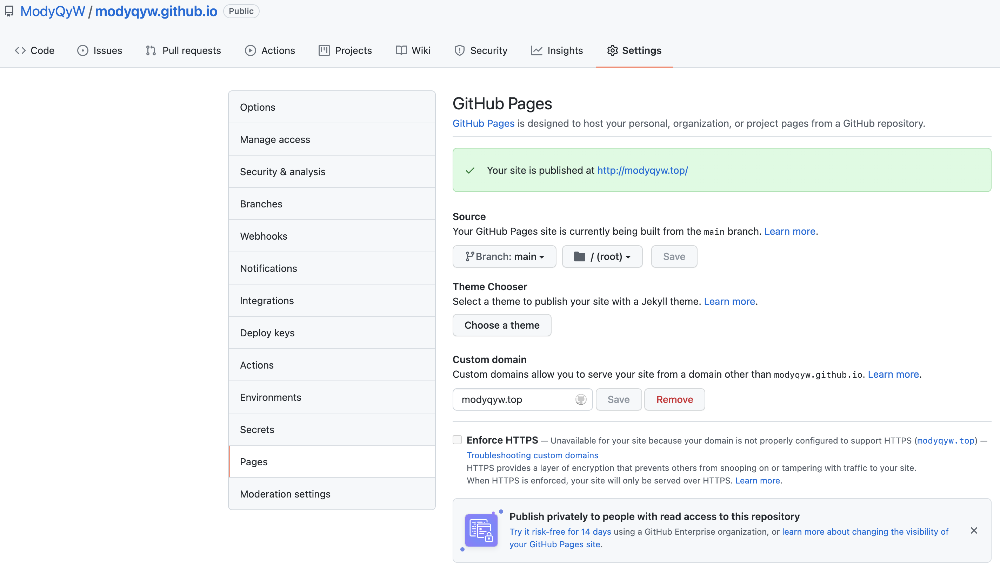
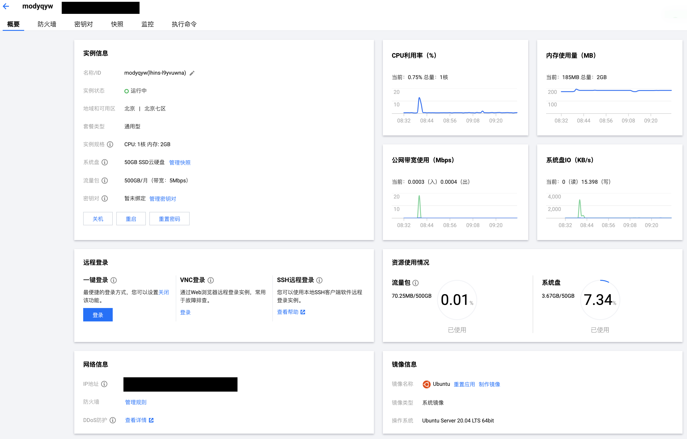
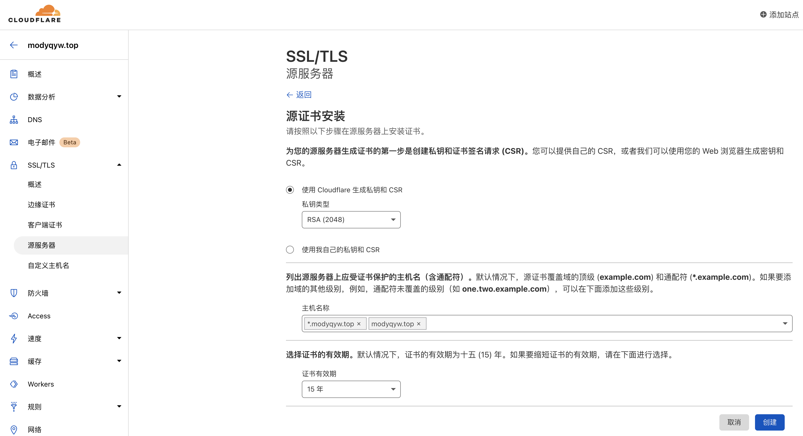
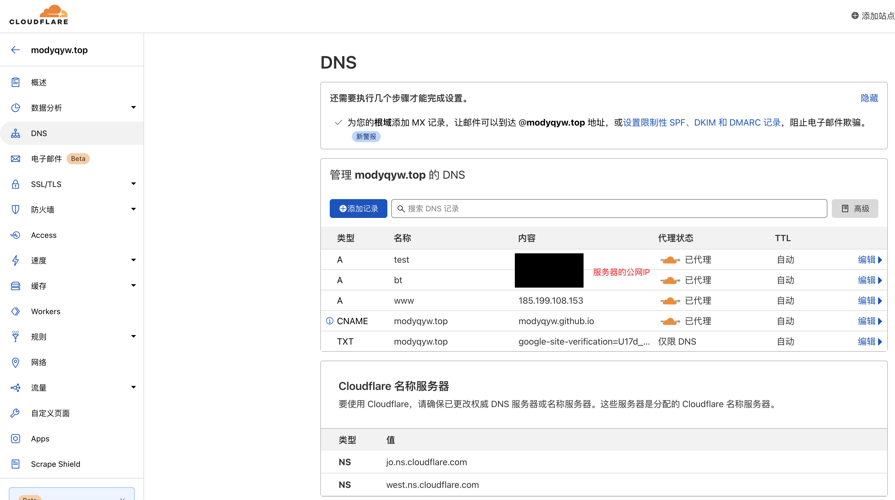

# 单服务器配置

记录我自己的单服务器配置。

## Github Pages 自定义域名和 HTTPS

我在 [阿里云](https://www.aliyun.com/product/list?source=5176.11533457&userCode=2ln7eli6) 买了域名 `modyqyw.top`，然后交给了 [Cloudflare](https://www.cloudflare.com/zh-cn/) 做解析。

为了让 Cloudflare 接管 [Github Pages](https://pages.github.com/)，我还修改了 DNS。其中，`185.199.108.153` 是 `ping modyqyw.github.io` 得到的结果；在 `modyqyw/modyqyw.github.io` 部署的目录下保存一个 [`CNAME` 文件](https://github.com/ModyQyW/modyqyw.github.io/blob/main/CNAME)，内容直接填写 `modyqyw.top`。


另外，还需要配置 Github Pages。



HTTPS 可以在 Cloudflare 里直接启用。


## 自己的服务器使用子域名和 HTTPS

双十一在 [腾讯云](https://cloud.tencent.com/act/cps/redirect?redirect=30206&cps_key=64b3890e1990670c5c6a30b97a4243e4) 买了轻量应用服务器，尝试自己配一下环境，为以后的全栈目标做准备。

我使用了 [Debian](https://www.debian.org/)，可能会有人更倾向于使用 [CentOS](https://www.centos.org/) 或者 [Ubuntu](https://ubuntu.com/)，没有高低之分。建议优先挑选公司内较多使用的，其次挑选个人喜欢的。



首先重置一下密码，不要修改默认账号。

生成自己的 RSA 密钥，可以参考 [Generating a new SSH key and adding it to the ssh-agent](https://docs.github.com/en/authentication/connecting-to-github-with-ssh/generating-a-new-ssh-key-and-adding-it-to-the-ssh-agent)，注意命令应该使用 `-t rsa`。

```sh
ssh-keygen -t rsa -b 4096 -C "your_email@example.com" # 生成 RSA 密钥，注意替换邮箱，一直回车即可，默认生成在 ~/.ssh 下
cat ~/.ssh/id_rsa.pub # 显示自己的 RSA 公钥
```

在页面上一键登录，修改 ssh，避免 ssh 频繁断开。这里使用了 `vim`，`nano` 也是一个不错的选择，可以自行了解。

```sh
sudo vim /etc/ssh/sshd_config
```

修改以下三行并保存。

```sh
AuthorizedKeysFile      .ssh/authorized_keys .ssh/authorized_keys2

ClientAliveInterval 120
ClientAliveCountMax 720
```

然后使用终端登录，把自己的 RSA 公钥添加到 `~/.ssh/authorized_keys` 和 `~/.ssh/authorized_keys2`，之后就可以免密登录了。

```sh
ssh root@[公网IP] # root 是默认账号，添加完公钥之后就可以一句命令免密登录了
```

升级一下依赖。

```sh
sudo apt update
```

配置 `ntp`，用于同步时间。

```sh
sudo install ntp
```

配置 `curl`。

```sh
sudo install curl
```

配置 `git`。

```sh
sudo install git
```

配置 `zsh`、`oh-my-zsh` 和 `nvm`。基本和 [环境配置](../environment/README.md#macos-intel) 里的描述一致，可能需要手动安装 `zsh` 并切换，看 `oh-my-zsh` 里的教程即可。

接着安装 [nginx](https://www.nginx.com/)，用于提供网站访问。

```sh
sudo apt install nginx # 安装 nginx
sudo ufw app list # 查看防火墙可选配置
sudo ufw allow 'Nginx Full' # 放行 nginx
sudo ufw allow 'OpenSSH' # 放行 openssh
sudo ufs enable # 启动防火墙
sudo ufw status # 确认防火墙状态
sudo systemctl status nginx # 检查 nginx 状态
```

```sh
# 正确的防火墙状态示例
Status: active

To                         Action      From
--                         ------      ----
Nginx Full                 ALLOW       Anywhere
OpenSSH                    ALLOW       Anywhere
Nginx Full (v6)            ALLOW       Anywhere (v6)
OpenSSH (v6)               ALLOW       Anywhere (v6)

```

```sh
# 正确的 nginx 状态示例
● nginx.service - A high performance web server and a reverse proxy server
     Loaded: loaded (/lib/systemd/system/nginx.service; enabled; vendor preset: enabled)
     Active: active (running)
       Docs: man:nginx(8)
   Main PID: 83574 (nginx)
      Tasks: 2 (limit: 2270)
     Memory: 6.0M
     CGroup: /system.slice/nginx.service
             ├─83574 nginx: master process /usr/sbin/nginx -g daemon on; master_process on;
             └─83575 nginx: worker process
```

现在可以通过 `http://[公网ip]` 访问服务器了，正常会显示 `nginx` 的默认页面。

一些相关的命令另外列写在下面。

```sh
sudo systemctl stop nginx # 停止 nginx 服务
sudo systemctl start nginx # 启动 nginx 服务
sudo systemctl restart nginx # 重启 nginx 服务
sudo systemctl reload nginx # nginx 重新读取配置
sudo systemctl disable nginx # 禁止 nginx 随系统启动
sudo systemctl enable nginx # 允许 nginx 随系统启动
```

默认地，`nginx` 会使用 `/var/www/html` 作为网站目录，但是对于一个服务器托管多个网站的情况，这相当不方便。所以，我使用 `/var/www/[网站域名]/html` 来托管我不同的网站，域名就使用 `modyqyw.top` 的二级域名，全部交给 Cloudflare 解析。

```sh
sudo mkdir -p /var/www/test.modyqyw.top/html # 测试网站用，bt.modyqyw.top
sudo mkdir -p /var/www/bt.modyqyw.top/html # 宝塔面板用，bt.modyqyw.top
sudo chown -R $USER:$USER /var/www/test.modyqyw.top/html # 修改权限
sudo chown -R $USER:$USER /var/www/bt.modyqyw.top/html
# sudo chown -R 755 /var/www/test.modyqyw.top/html
# sudo chown -R 755 /var/www/bt.modyqyw.top/html
```

然后在两个目录下都创建一个 `.html` 文件，用于之后检查效果。

```sh
sudo vim /var/www/test.modyqyw.top/html/index.html
sudo vim /var/www/bt.modyqyw.top/html/index.html
```

```html
<!DOCTYPE html>
<html lang="en">
  <head>
    <meta charset="utf-8" />
    <meta name="renderer" content="webkit" />
    <meta name="force-rendering" content="webkit" />
    <meta http-equiv="X-UA-Compatible" content="IE=Edge,chrome=1" />
    <meta
      name="viewport"
      content="width=device-width, user-scalable=no, initial-scale=1.0, maximum-scale=1.0, minimum-scale=1.0"
    />
    <link rel="icon" href="/favicon.ico" />
    <title>[网站域名]</title>
  </head>
  <body>
    <noscript>
      <strong>请允许 JavaScript 执行。</strong>
    </noscript>
    <div id="app"></div>
  </body>
</html>
```

为了避免可能的哈希桶内存问题，需要修改一下 `nginx` 配置。

```sh
sudo vim /etc/nginx/nginx.conf
```

```sh
...
http {
    ...
    server_names_hash_bucket_size 64;
    ...
}
...
```

检查一下 `nginx` 配置。

```sh
sudo nginx -t
```

```sh
# 没有问题的提示示例
nginx: the configuration file /etc/nginx/nginx.conf syntax is ok
nginx: configuration file /etc/nginx/nginx.conf test is successful
```

没有问题的话就可以着手添加 HTTPS 服务了。由于要交给 Cloudflare 做解析，所以我们需要 Cloudflare 认可的证书。

首先在 `/etc/ssl/certs/cloudflare.crt` [保存 Cloudflare 根证书](https://developers.cloudflare.com/ssl/origin-configuration/origin-ca#4-required-for-some-add-cloudflare-origin-ca-root-certificates)。注意，不能存在空行。

```sh
sudo vim /etc/ssl/certs/cloudflare.crt
```

然后到 Cloudflare 上申请服务器端证书，找到响应的页面点击 `创建证书` 即可。




在服务器上创建相应的证书文件，保存 Cloudflare 返回的数据。注意，不能存在空行。

```sh
sudo vim /etc/ssl/certs/common.pem # 保存证书部分的数据
sudo vim /etc/ssl/private/common.pem # 保存私钥部分的数据
```

把证书链接到对应的域名。

```sh
sudo ln -s /etc/ssl/certs/common.pem /etc/ssl/certs/test.modyqyw.top.pem
sudo ln -s /etc/ssl/private/common.pem /etc/ssl/private/test.modyqyw.top.pem
sudo ln -s /etc/ssl/certs/common.pem /etc/ssl/certs/bt.modyqyw.top.pem
sudo ln -s /etc/ssl/private/common.pem /etc/ssl/private/bt.modyqyw.top.pem
```

添加相应的域名配置。

```sh
sudo rm /etc/nginx/sites-enabled/default # 已经有域名配置了，移除默认的 html 文件
sudo vim /etc/nginx/sites-available/test.modyqyw.top
sudo vim /etc/nginx/sites-available/bt.modyqyw.top
```

```sh
server {
    listen 80;
    listen [::]:80;

    access_log  /var/log/nginx/[网站域名].access.log;
    error_log  /var/log/nginx/[网站域名].error.log debug; # debug 用于测试，后续测试没有错误后可以移除 debug

    server_name [网站域名];

    return 302 https://$server_name$request_uri;
}

server {

    # SSL configuration

    listen 443 ssl;
    listen [::]:443 ssl;
    ssl_certificate         /etc/ssl/certs/[网站域名].pem;
    ssl_certificate_key     /etc/ssl/private/[网站域名].pem;
    ssl_client_certificate /etc/ssl/certs/cloudflare.crt;
    ssl_verify_client on;

    access_log  /var/log/nginx/[网站域名].access.log;
    error_log  /var/log/nginx/[网站域名].error.log debug; # debug 用于测试，后续测试没有错误后可以移除

    server_name [网站域名];

    root /var/www/[网站域名]/html;
    index index.html index.htm index.nginx-debian.html;


    location / {
            try_files $uri $uri/ =404;
    }
}
```

把域名配置链接到 `nginx` 读取的位置。

```sh
sudo ln -s /etc/nginx/sites-available/test.modyqyw.top /etc/nginx/sites-enabled/
sudo ln -s /etc/nginx/sites-available/bt.modyqyw.top /etc/nginx/sites-enabled/
```

再次检查 `nginx` 配置，没问题的话重启 `nginx` 服务。

```sh
sudo nginx -t
sudo systemctl restart nginx
```

最后添加 Cloudflare 解析，等待一小段时间后访问 `https://[网站域名]` 测试即可。

如果有错误，可以检查对应的 `error.log`。如果没有错误，记得要去掉 `debug`，否则日志文件会非常大。



## 宝塔面板

## 数据库

## 参考

- [Initial Server Setup with Debian 10](https://www.digitalocean.com/community/tutorials/initial-server-setup-with-debian-10)
- [How to Install Nginx on Debian 10](https://www.digitalocean.com/community/tutorials/initial-server-setup-with-debian-10)
- [How To Host a Website Using Cloudflare and Nginx on Ubuntu 20.04](https://www.digitalocean.com/community/tutorials/how-to-host-a-website-using-cloudflare-and-nginx-on-ubuntu-20-04)
- [cloudflare developers](https://developers.cloudflare.com/)
